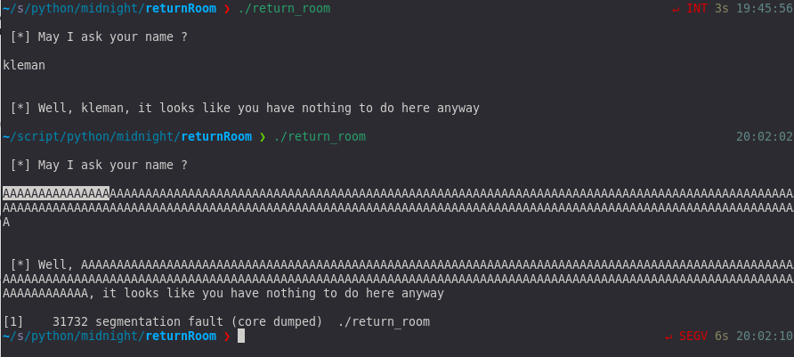
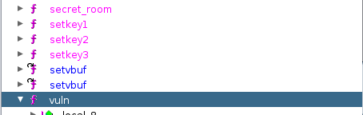
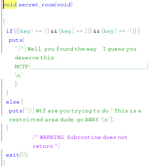
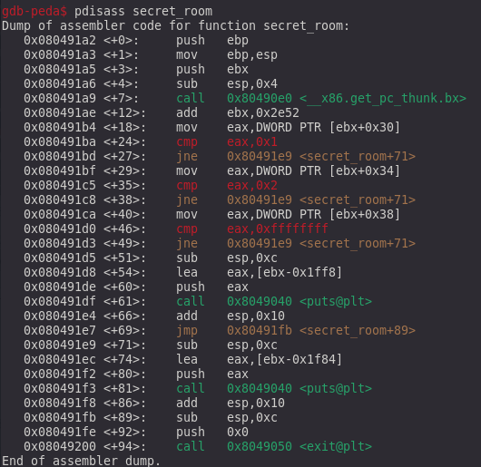
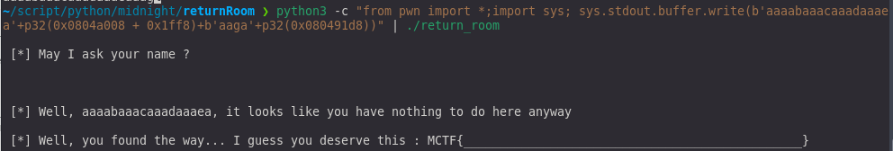

**_PWN_**

**TL;DR**

Ce chall de pwn est assez amusant. Avec le nom du chall, on pense tout de suite qu'il va falloir utiliser un bufferoverflow
pour faire une mini ROPchain mais j'ai utilisé une astuce pour simplifier l'exploitation.

**Analyse du chall**

on observe uniquement 1 input qui contient un bufferoverflow. Maintenant au travail !
Jetons un coup d'oeil avec ghidra.

Cinq fonctions nous sautent aux yeux: vuln qui est notre fonction qui fait un scanf
puis setkey1, setkey2, setkey3 et secret_room qui fait quelques checks avant d'afficher le flag.

On voit que le but du chall est de réussir à appeler la fonction secret_room avec les bonnes valeurs pour réussir
à puts notre flag.
Utilisons une petite astuce !  Au lieu de chainer les 3 fonctions setkey et de jump dans secret_room on peut essayer de jump direct
dans le puts pour afficher notre flag.

**exploitation**

On commence par lancer le code dans gdb avec une chaine cyclic. On réussit facilement à trouver l'offset pour écrire sur l'eip (pointeur d'instruction)

Maintenant essayons de jump juste avant le puts sur le lea eax,[ebx -0x1ff8] qui est l'argument du puts.

Il ne reste plus qu'à faire pointer ebx-0x1ff8 sur la chain qui contient le flag. Nous contrôlons ebx avec notre bufferoverflow
donc le travail est deja quasiment fait. Il suffit de trouver la chaine qui contient le flag.
La chaine trouve en 0x0804a008.
Il faut que ebx soit égal a 0x804c000 (0x0804a008+0x1ff8).
une fois fini on assemble sa payload

    python3 -c "from pwn import *;import sys; sys.stdout.buffer.write(b'aaaabaaacaaadaaaea'+p32(0x0804a008 + 0x1ff8)+b'aaga'+p32(0x080491d8))"

L'exploit marché en local. Il suffit maintenant de la pipe dans un netcat et le tour est joué.

Merci encore aux créateurs et organisateurs du CTF qui était vraiment super!
