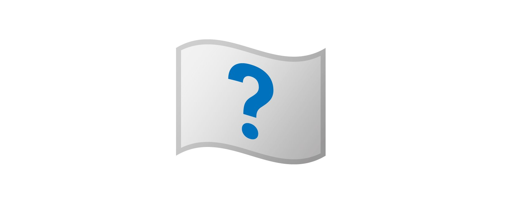

layout: post
title: ReadTeamVillage CTF 2021 Something, Something, Haystack.
tag: misc
---

**_MISC_**

## **Analyse du chall**

En premier lieu on télécharge le zip de 120 Mo
puis on le unzip. On remarque que le répertoire flag contient énormement de fichiers pas étonnant quand on voit la taille du zip.

En ouvrant les premières images on remarque qu'elles ont toutes l'air identiques.  

La question est : sont-elles toutes vraiment identiques ?

## **Résolution**

Pour vérifier si les images sont bien toutes identiques on va faire une somme MD5 sur chacune.

    for img in $(ls ./flags); do
      echo "$(md5sum ./flags/$img)"
    done > out.txt

Plus qu'à vérifier s'il n'y a pas une image qui est identique aux autres.

    cat out.txt | grep -v 7045b8920411be26d5b2ae3b44cef3ef

Une image differente sort, de plus elle possède une chaine de caractères qui ressemble à un flag.
On voit tout de suite qu'il s'agit d'un chiffrement César. Tentons un ROT13.

Flag !
