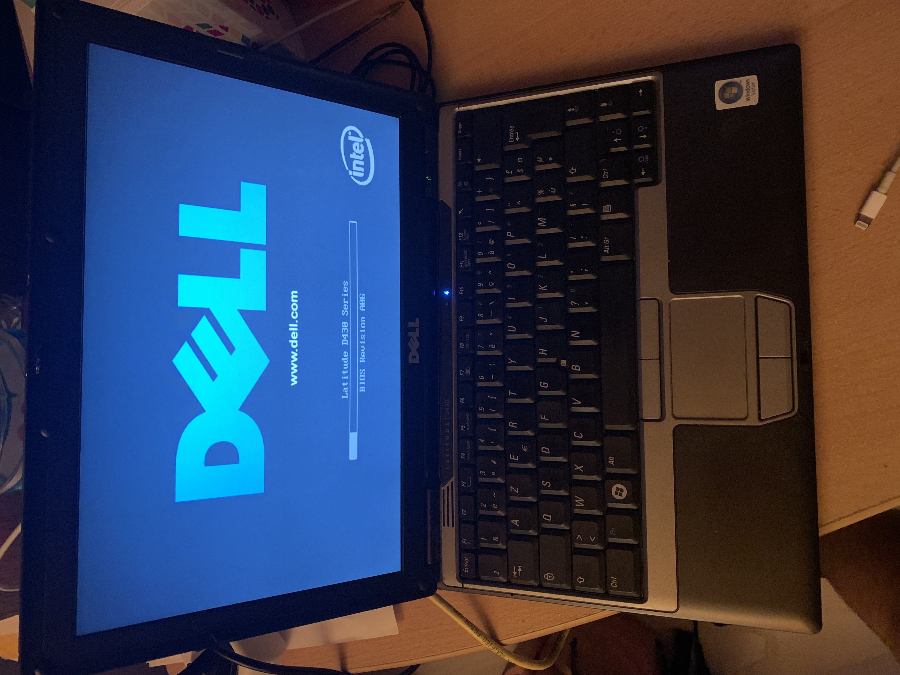

**_Transformer un pc portable en carte wifi pour ne pas être obligé de faire un trou dans le mur de papa maman_**

# **TL;DR**

Actuellement en vacances je suis confronté au problème du câble ethernet, En effet quand je suis chez moi je peux tirer un cable ethernet entre ma box et mon pc mais chez mes parents ce n'est pas possible. Sachant que ma tour n'a pas de carte wifi il va falloir trouver une solution.


# **Prérequis**

Pour redonner le saint internet à notre ordinateur nous allons avoir besoin de:

1. ordinateur portable avec wifi et une prise ethernet.
2. cable ethernet.
3. clef usb avec une debian(ou autre) dessus.

# **Hardware**

Pour ma part j'ai utilisé un ordie portable d'exception:

un dell latitude d430 avec ses 2GO de ram ainsi que sont processeur cadencé a 1,2 GHz



# **Concept**


Notre pc portable va être sur deux réseaux, le premier est le réseau wifi de la maison le deuxième est un réseau contenant le pc portable ainsi que le pc fix.

Nous allons configurer notre pc portable pour transférer les paquets du réseau pc fix sur le réseaux wifi de la maison. Pour cela nous allons utiliser iptables pour \"\"\"[naté](https://fr.wikipedia.org/wiki/Network_address_translation)\"\"\" les paquets d'un réseau à l'autre. Pour simplifier l'utilisation de la solution nous allons également installer un serveur DHCP.

# **Setup**

## **Config de base**

Dans notre cas nous n'avons pas besoin d'interface graphique donc une debian \"\"\"vierge\"\"\" devrait faire l'affaire en cas d'une installation plus complète il faudrait désactiver network-manager voir le désinstaller.

```
systemctl stop NetworkManager
systemctl disable NetworkManager
```

Il faut maintenant configurer votre wifi via wpa_supplicant un super article explique comment faire [ici](https://debian-facile.org/doc:reseau:wpasupplicant#:~:text=Ajouter%20un%20profil%20wifi,-La%20commande%20wpa_passphrase&text=en%20rempla%C3%A7ant%20votre%2Dssid%20par,%2Fetc%2Fwpa_supplicant%2Fwpa_supplicant.)

```
root@debian:~# ip link show
1: lo: <LOOPBACK,UP,LOWER_UP> mtu 65536 qdisc noqueue state UNKNOWN mode DEFAULT group default qlen 1000
    link/loopback 00:00:00:00:00:00 brd 00:00:00:00:00:00
2: enp9s0: <BROADCAST,MULTICAST,UP,LOWER_UP> mtu 1500 qdisc mq state UP mode DEFAULT group default qlen 1000
    link/ether 00:1c:23:5b:60:d7 brd ff:ff:ff:ff:ff:ff
3: wlp12s0: <BROADCAST,MULTICAST,UP,LOWER_UP> mtu 1500 qdisc mq state UP mode DORMANT group default qlen 1000
    link/ether 00:1f:3c:75:54:4a brd ff:ff:ff:ff:ff:ff
```

Durant la suite de l'article l'interface **wlp12s0** correspond aux **wifi de la maison** et l'interface **enp9s0** correspond aux réseaux **pc fix**.

Pour configurer nos interfaces réseau il faut éditer le fichier

>/etc/network/interfaces

Le bloque wifi maison permet de configurer l'interface wifi en dhcp.

Le deuxième bloc, celui du réseau pc fix configure l'interface filaire en static on lui fournit donc une adresse et un masque de sous réseau.(Pour les 3 tatillons du fond le /24 est overkill un /30 serait plus adapté)

```
root@debian:~# cat /etc/network/interfaces
# This file describes the network interfaces available on your system
# and how to activate them. For more information, see interfaces(5).

source /etc/network/interfaces.d/*

# The loopback network interface
auto lo
iface lo inet loopback

# bloc reseaux wifi maison
allow-hotplug wlp12s0
iface wlp12s0 inet manual
	wpa-driver nl80211
	wpa-roam /etc/wpa_supplicant/wpa_supplicant.conf

iface maison inet dhcp

# bloc reseaux pc fix
allow-hotplug enp9s0
iface enp9s0 inet static
	address 10.0.0.1
	netmask 255.255.255.0
```

Il faut également suprimer le fichier par default  dans :

> /etc/network/interfaces.d/

Pour faire simple ce fichier contient une config avec le nom des interfaces normalisées (eth0,wlan0,...) ce qui crée des erreurs. C'est pour cela qu'il faut le supprimer.

Il faut ensuite rebooté la machine ou redémaré le service qui gère le réseaux personnellement je préfére rebooté pour etre sur que tout roule.

```
systemctl restart networking
ou
reboot
```

## **Vérification**

```
root@debian:~# ip a
1: lo: <LOOPBACK,UP,LOWER_UP> mtu 65536 qdisc noqueue state UNKNOWN group default qlen 1000
    link/loopback 00:00:00:00:00:00 brd 00:00:00:00:00:00
    inet 127.0.0.1/8 scope host lo
       valid_lft forever preferred_lft forever
    inet6 ::1/128 scope host
       valid_lft forever preferred_lft forever
2: enp9s0: <BROADCAST,MULTICAST,UP,LOWER_UP> mtu 1500 qdisc mq state UP group default qlen 1000
    link/ether 00:1c:23:5b:60:d7 brd ff:ff:ff:ff:ff:ff
    inet 10.0.0.1/24 brd 10.0.0.255 scope global enp9s0
       valid_lft forever preferred_lft forever
    inet6 fe80::21c:23ff:fe5b:60d7/64 scope link
       valid_lft forever preferred_lft forever
3: wlp12s0: <BROADCAST,MULTICAST,UP,LOWER_UP> mtu 1500 qdisc mq state UP group default qlen 1000
    link/ether 00:1f:3c:75:54:4a brd ff:ff:ff:ff:ff:ff
    inet 192.168.1.32/24 brd 192.168.1.255 scope global dynamic wlp12s0
       valid_lft 70799sec preferred_lft 70799sec
    inet6 2a01:cb10:835b:4f00:21f:3cff:fe75:544a/64 scope global dynamic mngtmpaddr
       valid_lft 86386sec preferred_lft 586sec
    inet6 fe80::21f:3cff:fe75:544a/64 scope link
       valid_lft forever preferred_lft forever
```

## **DHCP Server**

Nous voilà à l'installation et la configuration du serveur DHCP qui permettra d'attribuer automatiquement une config ip + server DNS + gateway au pc fix. Pour cela

```
apt install isc-dhcp-server
```

Premièrement il faut expliciter sur quelle interface le serveur dhcp écoute.

```
root@debian:~# cat /etc/default/isc-dhcp-server
# Defaults for isc-dhcp-server (sourced by /etc/init.d/isc-dhcp-server)

# Path to dhcpd's config file (default: /etc/dhcp/dhcpd.conf).
#DHCPDv4_CONF=/etc/dhcp/dhcpd.conf
#DHCPDv6_CONF=/etc/dhcp/dhcpd6.conf

# Path to dhcpd's PID file (default: /var/run/dhcpd.pid).
#DHCPDv4_PID=/var/run/dhcpd.pid
#DHCPDv6_PID=/var/run/dhcpd6.pid

# Additional options to start dhcpd with.
#	Don't use options -cf or -pf here; use DHCPD_CONF/ DHCPD_PID instead
#OPTIONS=""

# On what interfaces should the DHCP server (dhcpd) serve DHCP requests?
#	Separate multiple interfaces with spaces, e.g. "eth0 eth1".
INTERFACESv4="enp9s0"
INTERFACESv6=""
```

Il faut maintenant paramétrer le serveur **dhcp** pour cela il faut choisir un serveur dns ainsi qu'une range. Nous utilisons un masque de 24 donc la plage addressable est 10.0.0.1-254. Dans notre cas nous utiliserons les DNS de clouldflare ainsi qu'un range de 10.0.0.2-254 (10.0.0.1 est utilisé par notre pc portable).

```
root@debian:~# cat /etc/dhcp/dhcpd.conf

option domain-name "local";
option domain-name-servers 1.1.1.1;

default-lease-time 600;
max-lease-time 7200;

subnet 10.0.0.0 netmask 255.255.255.0 {
	range 10.0.0.2	10.0.0.254;
	option routers	10.0.0.1;
}
```

Il faut maintenant activer le serveur dhcp

```
systemctl start isc-dhcp-server
systemctl enable isc-dhcp-server
```

Maintenant en connectant le câble ethernet entre le pc portable et le pc fix celui ci devait avoir une config qui tombe.


## **NAT**

Il faut maintenant configurer le nat entre les deux réseaux ainsi.

Premièrement il faut accepté tous les paquets que l'on reçoit pour cela il faut activer un paramètre dans le kernel. Pour cela

```
echo 1 > /proc/sys/net/ipv4/ip_forward
```

Pour rendre le changement permanent il suffit de modifier le fichier

> /etc/sysctl.conf

Et de décommanter la ligne **net.ipv4.ip_forward=1**

Une fois cela effectuer, nous allons devoir paramétrer le nat avec iptables.


```bash
iptables -A FORWARD -i enp9s0
iptables -A FORWARD -o enp9s0
iptables -t nat -A POSTROUTING -o wlp12s0 -j MASQUERADE
```

La première ligne permet d'accepter les paquets en direction d'un autre réseaux. La deuxième permet de mettre en place le nat.

Pour rentré tous ses changements persistant il vous faut installer le paquet iptables-persistent

```
apt install iptables-persistent
iptables-save  > /etc/iptables/rules.v4
```

## **Instant tuning**


Maintenant que tout fonctionne en plug and play j'aimerais rajouté deux features, la première, d'empêcher le verrouillage de l'ordinateur quand je ferme l'ecrant. La deuxième, d'avoir du monitoring de se qu'il ce passe sur le laptop.

### **Désactiver le Vérouillage**

Nous avons besoin de modifier le fichier
> /etc/systemd/logind.conf

Il suffit d'ajouter **HandleLidSwitch=ignore**

Puis d'appliquer les changements

```
systemctl restart systemd-logind
```

### **Monitoring**

Nous allons ajouter du monitoring pour cela nous allons désactiver le login screen sur les tty 1 à 3 et les remplacer par tcpdump, htop, journalctl.

Pour réaliser cela nous allons devoir créé des services systemd.

```bash
#installation des packages
apt install tcpdump htop
```

Il faut créer trois fichiers dans

> /etc/systemd/system

```
root@debian:/etc/systemd/system# cat tcpdump_tty1.service
[Unit]
Description=tcpdump on tty1
After=getty.target
Conflicts=getty@tty1.service

[Service]
Type=simple
Restart=always
ExecStart=/usr/bin/tcpdump
StandardInput=tty-force
StandardOutput=inherit
StandardError=inherit
TTYPath=/dev/tty1

[Install]
WantedBy=multi-user.target
```

```
cat htop_tty2.service
[Unit]
Description=htop on tty2
After=getty.target
Conflicts=getty@tty2.service

[Service]
Type=simple
Restart=always
ExecStart=/usr/bin/htop
StandardInput=tty
StandardOutput=inherit
StandardError=inherit
TTYPath=/dev/tty2

[Install]
WantedBy=multi-user.target
```

```
root@debian:/etc/systemd/system# cat journalctl_tty3.service
[Unit]
Description=htop on tty3
After=getty.target
Conflicts=getty@tty3.service

[Service]
Type=simple
Restart=always
ExecStart=/usr/bin/journalctl -ef
StandardInput=tty
StandardOutput=inherit
StandardError=inherit
TTYPath=/dev/tty3

[Install]
WantedBy=multi-user.target
```

Il faut maintenant désactiver les logscreen sur les tty ainsi qu'ajouter nos services au démarrage.

```bash
# pour prendre en compte les nouveau service
systemctl daemon-reload

#desactivation des tty 1-3
systemctl stop getty@tty1.service
systemctl disable getty@tty1.service

systemctl stop getty@tty2.service
systemctl disable getty@tty2.service

systemctl stop getty@tty3.service
systemctl disable getty@tty3.service

systemctl start tcpdump_tty1.service
systemctl enable tcpdump_tty1.service

systemctl start htop_tty2.service
systemctl enable htop_tty2.service

systemctl start journalctl_tty3.service
systemctl enable journalctl_tty3.service
```

Maintenant nous avons une solution plus and play que même mon papa peut utiliser. Avec en prime une visuelle de hacker(on voit tous les paquets qui passent sur la tty1) et du monitoring rapide.

> **_WARNING:_**  L'utilisation de tcpdump demande beaucoup de ressources. Pour une utilisation sur le long temps il vaut mieux le désactiver.
