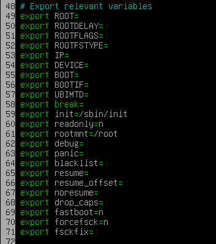

**_Modifier la partition de boot pour récupérer la passphrase luks_**

# **TL;DR**

Actuellement dans un train arrêté sur la voie depuis plus 1h et sans réseau j'ai voulu trouver un moyen de récupérer la passphrase d'une partition luks.

# **Concept**

Notre but est de récupérer la passphrase luks d'une partition. Le bruteforce de partition luks est trés lent ce que rendent les attaques par dictionnaire quasiment impossible. Il reste la solution du social engenering, il est possible d'utiliser un keylogger hardware et récupérer la passphrase via un réseau wifi ou bluetooth ou de le faire de manière software. Nous verrons comment mettre en place cette dernière.


# **Theorie**

Grandement inspiré de cette [article](https://yassine.tioual.com/posts/backdoor-initramfs-and-make-your-rootkit-persistent/)


le démarrage de linux ce résume en 5 étape:

1. Le programme de la carte-mère qui va initialiser le hardware
2. Le bootloader qui va venir chercher sur le disque le kernel et l'exécuter
3. Le kernel va initialiser toutes ses fonctions
4. L'archive initramfs va être décompressée en ram et un script va venir monter tous le fs.
5. Systemd reprend la main et viens démarrer ses services.

Le kernel ainsi que la l'archive initramfs est disponible dans /boot

Dans la suite de l'article nous allons utiliser debian.

## **Comprendre initramfs**

initramfs est une archive compressée contenue dans /boot qui possède un système de fichiers qui sera chargé en ram. Un script situé dans /init est exécuté et viendra monter les partitions dans un nouveau répertoire root et finir par exécuter un chroot dedans puis à exécuter systemd.

Il est possible d'analyser le contenu de cette archive en l'extrayant. L'algorithme de compression peut varier selon les distributions il faut donc utiliser la commande **file** pour déterminer celui-ci. Il restera ensuite une archive cpio.

```
mkdir -p work && cd work
cp /boot/initrd.img-5.10.0-10-amd64 ./initrd.img-5.10.0-10-amd64.gz
gunzip ./initrd.img-5.10.0-10-amd64.gz
cpio -idv < ./initrd.img-5.10.0-10-amd64
```


## **mise en pratique**

En navigant dans le système de fichiers on trouve trés vite le script en charge de la partion luks.

> ./scripts/local-top/cryptroot


run_keyscript vient appeler le binaire askpass permettant de récupérer le password puis le copy sur la sortie standard. La passphrase est envoyé à unlock_mapping.


La modification permet de stocker la passphrase sur le système de fichiers dans /.init, cela nous servira plus loin.

Par défaut les partions sont montés en read-only.Il faut donc modifier le script init pour désactiver le RO et de rajouter une crontab permettant d'envoyer le password sur le réseau.

Pour cela rendez-vous dans
> ./init




Il faut donc modifier la variables readonly en lui assignant **n** pour pouvoir modifier par la suite le système de fichiers.

Il ne reste plus qu'à rajouter une commande juste avant le chroot sur le nouveau système de fichiers pour ajouter une ligne dans la crontab et ainsi récupérer la passphrase une fois la machine bootée.


Il ne reste plus qu'à recompresser notre archive et s'en servir pour remplacer l'archive légitime

```
find . | cpio -oH newc | gzip > /boot/initrd.img-5.10.0-10-amd64
```

Il ne reste plus qu'à attendre que quelqu'un boot l'ordinateur et tape la passphrase.


```
echo -n 43686576616c6f506b54506172746965 | xxd -r -p
```
